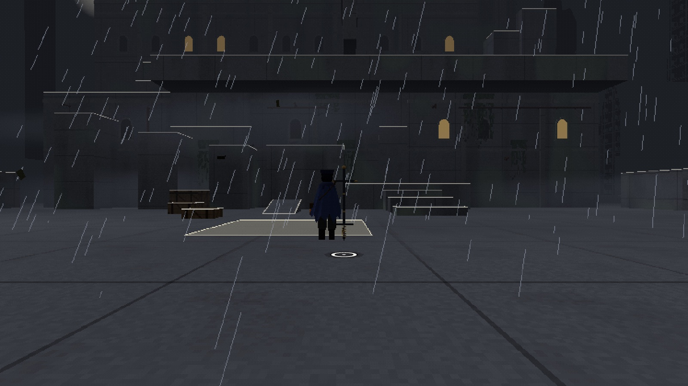

# The Endless Journey of a Nameless Courier

A pogo stick climbing game in the browser.

**[▶ Play](https://wilhelmtells.github.io/nameless-courier/)**

---

Made with [TypeScript](https://www.typescriptlang.org/),
[Three.js](https://threejs.org/), [Rapier](https://rapier.rs/) and
[Vite](https://vite.dev/). All models, textures and sounds are generated in
code; there are no external assets.

`npm install`, then `npm run dev` (Node 22).

Add `?debug` to the URL for the debug mode: a tuning panel for the pogo and
the camera, teleports to every zone and rest spot, and a free-flying camera
([try it](https://wilhelmtells.github.io/nameless-courier/?debug)).
